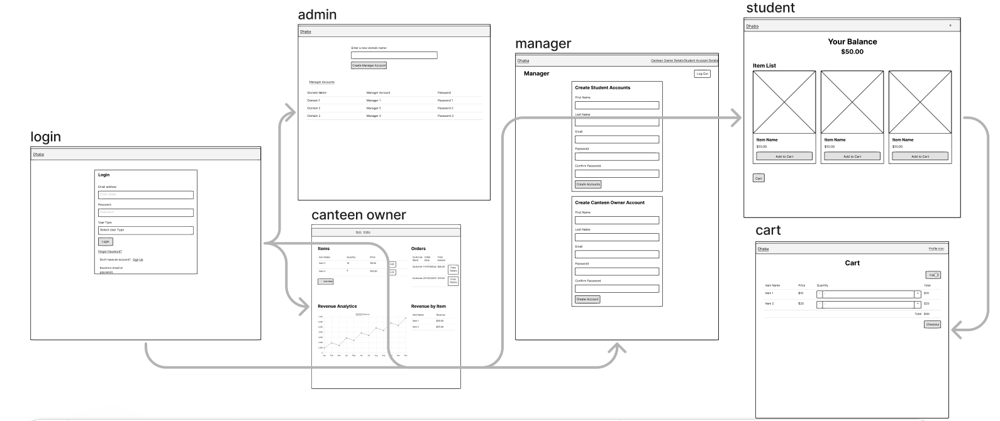

# Dhaba

## Overview
*(TODO: Dhaba is a comprehensive web application designed to streamline school canteen operations. It caters to the needs of school administrators, canteen owners, and students, providing a seamless experience for managing accounts, updating menus, and making purchases. The frontend will be built using the React library for a more responsive and dynamic user interface.)*

## Data Model

The application will be controlled by an admin whose credentials will be saved in a dotenv file. The application will have one collection called domains that will store Domains, Manager, Canteen Owners, and Students hierarchally.

- **Admin** can create and manage Manager accounts on different domains
- **Domains** each schools portal is served on a different domain and the data is stored by the domain
- **Manager** each school will have a manager who creates canteen owner and student accounts
- **Canteen Owners** can update menus and monitor revenue.
- **Students** can check balances, add items to their cart, and make purchases.

## An Example Domain:

```
test: {
  staff:{
    test_manager:{
      hash: // a password hash
    },
    test_canteen_owner:{
      hash:  //a password hash,
      revenue: 1000,
      price_list:{apple:3,banana:5}
    }
  },
  students:{
    1001 : {
      hash:  //a password hash,
      balance: 100
    },
    1002 : {
      hash:  //a password hash,
      balance: 200
    }
  }
}
```

## Technology Stack

- Frontend: React
- Backend: Node.js and Express.js
- Database: MongoDB


## Wireframes

/login - Allows users to login


/admin - Allows admin to make and handle manager accounts


/{domain}/manager - Allows manager of that domain to make canteen owner and student accounts


/{domain}/canteen_owner - Allows canteen owner of that domain to set up inventory and track orders


/{domain}/{student_id} - Allows relevant student of that domain to add items to cart


/{domain}/{student_id}/cart - Allows relevant student of that domain to view their cart


## Sitemap



## User Stories

### Admin Stories:
- As an **Admin**, I want to be able to log in securely with my credentials.
- As an **Admin**, I want to create Manager accounts for different school domains.
- As an **Admin**, I want the ability to manage (create, update, delete) Manager accounts.

### Domain Stories:
- As a **Domain**, I want to have a dedicated portal served on a unique domain.
- As a **Domain**, I want to store data hierarchically, keeping staff and student information organized.

### Manager Stories:
- As a **Manager**, I want to log in securely with my credentials.
- As a **Manager**, I want to create Canteen Owner and Student accounts for my school domain.
- As a **Manager**, I want to manage (create, update, delete) Canteen Owner and Student accounts.

### Canteen Owner Stories:
- As a **Canteen Owner**, I want to log in securely with my credentials.
- As a **Canteen Owner**, I want to update menus to reflect the available items and their prices.
- As a **Canteen Owner**, I want to monitor my revenue and see the price list for items.

### Student Stories:
- As a **Student**, I want to log in securely with my credentials.
- As a **Student**, I want to check my account balance.
- As a **Student**, I want to add items to my cart for purchase.

## Research Topics
- (5 points) Implement Passport.js for authentication of all users
- (3 points) Use dotenv for configuration for database, admin login etc
- (5 points) Integrate React for a more dynamic user interface, state management and react router for navigation within the application

